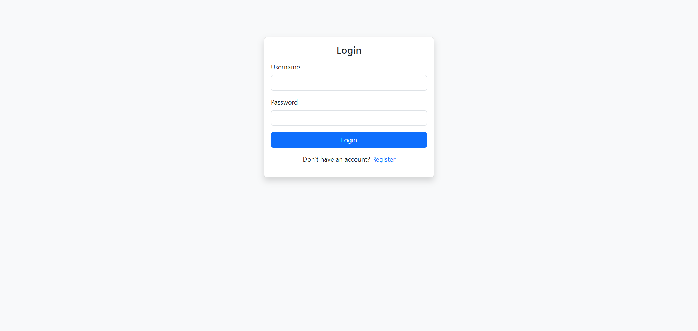
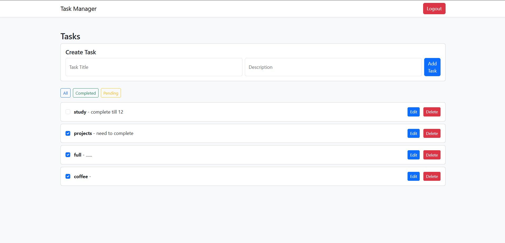

# 📝 Task Management System

A full-stack **Task Management System** built using **Django REST Framework** and **Vanilla JavaScript** with JWT Authentication.

---

## 🚀 Features
- User Registration & Login (JWT Auth)
- Access & Refresh Token handling
- Create, Update, Delete Tasks
- Task Status (Completed / Pending)
- Pagination & Filtering
- Admin can view and manage all user tasks
- Secure API with Permissions

## 🔐 Role-Based Access Control
- Uses Django Groups for permissions
- Admin users can view & manage all tasks
- Normal users can manage only their own tasks
- Permissions enforced at API level

---

## 🛠 Tech Stack
**Backend**
- Python
- Django
- Django REST Framework
- Simple JWT

**Frontend**
- HTML
- CSS (Bootstrap)
- JavaScript (Axios)

---

## ⚙️ Backend Setup

```bash
pip install -r requirements.txt
python manage.py migrate
python manage.py createsuperuser
python manage.py runserver

```
🌐 Frontend Setup

Open login.html in browser

Make sure backend is running at:

http://127.0.0.1:8000/

🔐 API Authentication

JWT Access Token stored in localStorage

Auto refresh using Axios Interceptor

## 👥 User Groups & Permissions

This project uses **Django Groups** for role-based access control.

### 🔹 Steps to Create Groups
1. Login to Django Admin:
http://127.0.0.1:8000/admin/


2. Go to **Authentication and Authorization → Groups**

3. Create Groups:
- **Admin**
- **User**

4. Assign Permissions:
- Admin Group:
  - Can view, add, change, delete **Task**
- User Group:
  - Can view, add, change **own Task**

5. Assign Users to Groups:
- Open a user → select Group → Save

## 📸 Screenshots

### 🔐 Login Page


### 📝 Register Page


### 📋 Task Dashboard



👤 Author

Vivek More
